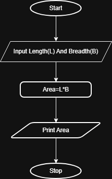

## Problem Statement
Write a Python program to calculate the area of a rectangle given its length and width.

---

## Algorithm
1. Start  
2. Read the length `l` and Width `b`from the user  
3. Calculate the area using the formula:  
   Area = l*b  
4. Display the area  
5. Stop  
---

## Flowchart

---

## Execution

  

