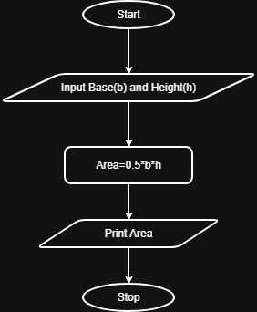

## Problem Statement
Write a Python program that prompts the user to enter the triangle's base and height and computes the triangle's area.

---

## Algorithm
1. Start.  
2. Read the base b and height h of the triangle.
3. Calculate the area using the formula:
   Area=0.5×𝑏×ℎ.
4. Display the area.
5. Stop.
---

## Flowchart

---

## Execution

  

